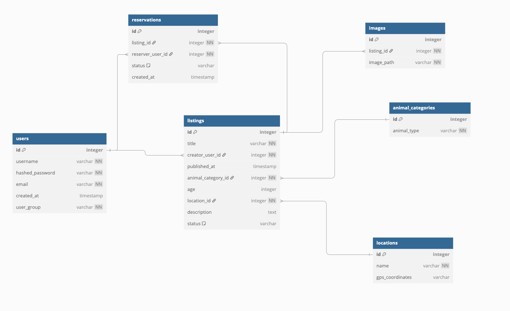

# Pupilove
Aplikacja to platforma ogłoszeniowa dla schronisk i użytkowników indywidualnych, umożliwiająca dodawanie, edycję oraz usuwanie ogłoszeń o zwierzętach do adopcji. Użytkownicy mogą przeglądać dostępne zwierzęta, filtrować ogłoszenia oraz kontaktować się z opiekunami w celu adopcji.
## Scenariusz wysokiego obciążenia
-   Pojawia się ogłoszenie o bardzo popularnym zwierzaku (np. rzadkiej rasy psa).
-   Wielu użytkowników odwiedza stronę ogłoszenia jednocześnie, co prowadzi do dużej liczby zapytań **SELECT** do bazy danych.
## Propozycja rozwiązania
**Percona XtraDB Cluster + ProxySQL**
-   **Percona XtraDB Cluster** zapewni replikację i wysoką dostępność bazy, eliminując pojedynczy punkt awarii.
-   **ProxySQL** pozwoli rozłożyć ruch na wiele node'ów.
## Model bazy danych

## Dodanie ogłoszenia do adopcji

**A. Aktor:** Użytkownik  
**B. Warunki wstępne:** Użytkownik musi być zalogowany  
**C. Scenariusz:**  
1. Użytkownik wybiera opcję "Dodaj ogłoszenie".  
2. Użytkownik wpisuje wymagane dane:
   - Tytuł ogłoszenia (title)
   - Kategorię (category)
   - Wiek (age)
   - Lokalizację (location)
   - Opis (description)
   - Zdjęcia (images)  
3. Użytkownik zatwierdza wprowadzone dane.  
4. System sprawdza poprawność danych:
   - **4.1. Dane są błędne** → Wyświetlane jest odpowiednie ostrzeżenie, a użytkownik musi poprawić dane.
   - **4.2. Dane są poprawne** → Ogłoszenie zostaje dodane do systemu.

---

## Wyszukiwanie ogłoszenia

**A. Aktor:** Użytkownik
**B. Warunki wstępne:** Użytkownik musi znajdować się na stronie  
**C. Scenariusz:**  
1. Użytkownik wybiera filtry wyszukiwania.  
2. System wyszukuje ogłoszenia zgodnie z wybranymi przez użytkownika filtrami:
   - **2.1. Brak wyników** → Wyświetlane jest odpowiednie ostrzeżenie.
   - **2.2. Znaleziono wyniki** → Rezultaty zostają wyświetlone.

---

## Proces rezerwacji

**A. Aktor:** Użytkownik  
**B. Warunki wstępne:** Użytkownik musi być zalogowany  
**C. Scenariusz:**  
1. Użytkownik wybiera ogłoszenie.  
2. Użytkownik klika przycisk "Rezerwuj".  
3. System sprawdza, czy istnieją wcześniejsze rezerwacje:  
   - **3.1. Brak wcześniejszych rezerwacji** → Użytkownik otrzymuje pierwsze miejsce w kolejce.
   - **3.2. Istnieją wcześniejsze rezerwacje** → Użytkownikowi wyświetla się jego aktualna pozycja w kolejce.
4. Właściciel ogłoszenia otrzymuje powiadomienie o nowej rezerwacji.  
5. Gdy rezerwacja użytkownika staje się aktywna, użytkownik otrzymuje powiadomienie i ma określony czas na jej potwierdzenie.  
6. Jeśli użytkownik nie potwierdzi rezerwacji w wyznaczonym czasie:  
   - **6.1. Rezerwacja wygasa** → Przechodzi na kolejną osobę w kolejce.   
7. Po potwierdzeniu rezerwacji użytkownik umawia się na adopcję lub spotkanie z właścicielem ogłoszenia.
8. Rozpatrzenie rezerwacji
   - 8.1 Jeśli użytkownik składający rezerwację zostanie zaakceptowany do adopcji:
      - Status rezerwacji zmienia się na **zaakceptowana**.
      - Status ogłoszenia zmienia się na **nieaktualne**.
   - 8.2 Jeśli użytkownik nie zostanie zaakceptowany:
      - Status ogłoszenia pozostaje bez zmian.
      - Status rezerwacji zmienia się na **odrzucona**.

---
## Przypadki użycia aplikacji
-   **Rejestracja i logowanie użytkownika** – użytkownik rejestruje się, loguje i zarządza swoim kontem.
-   **Dodawanie ogłoszeń o adopcji** – zalogowany użytkownik może dodać ogłoszenie o zwierzaku do adopcji.
-   **Edycja i usuwanie ogłoszeń** – użytkownik może modyfikować swoje ogłoszenia lub je usuwać, gdy zwierzę zostanie adoptowane.
-   **Przeglądanie ogłoszeń** – wszyscy użytkownicy (w tym niezalogowani) mogą przeglądać listę dostępnych zwierząt.
-   **Filtrowanie i wyszukiwanie ogłoszeń** – możliwość wyszukiwania zwierząt według różnych kryteriów (gatunek, lokalizacja).
-   **Kontakt w sprawie adopcji** – użytkownik może wysłać zapytanie o adopcję do autora ogłoszenia.
-   **Rezerwacje** – użytkownik rezerwuje zwierzę, system stosuje mechanizm kolejkowy.
-   **Zarządzanie rezerwacjami** - użytkownik może usuwać swoje rezerwacje

